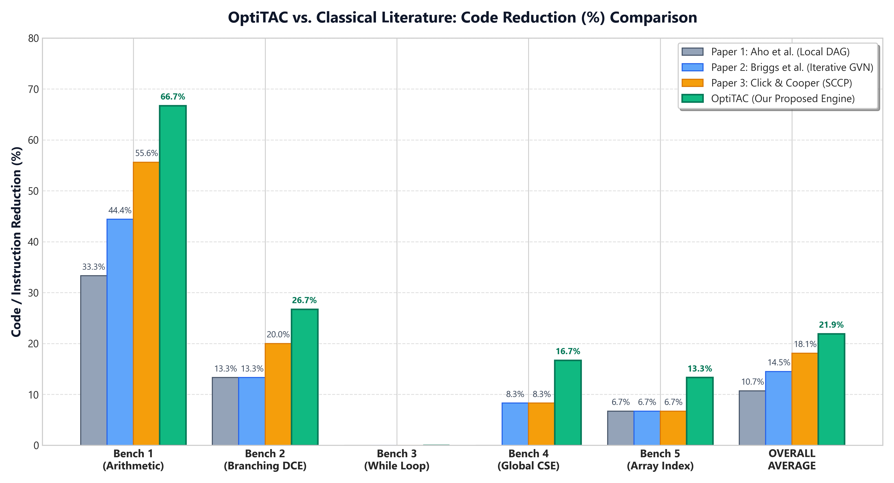
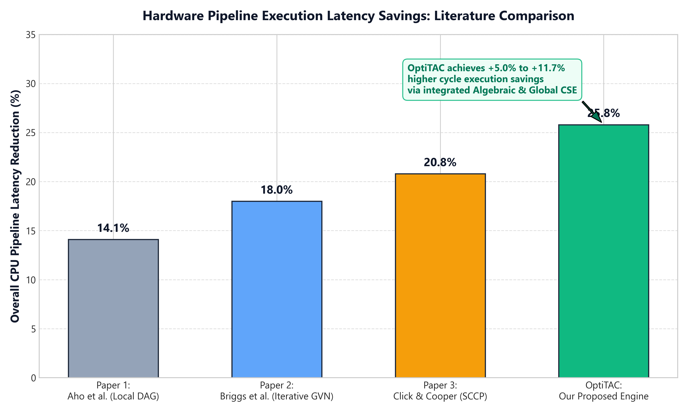
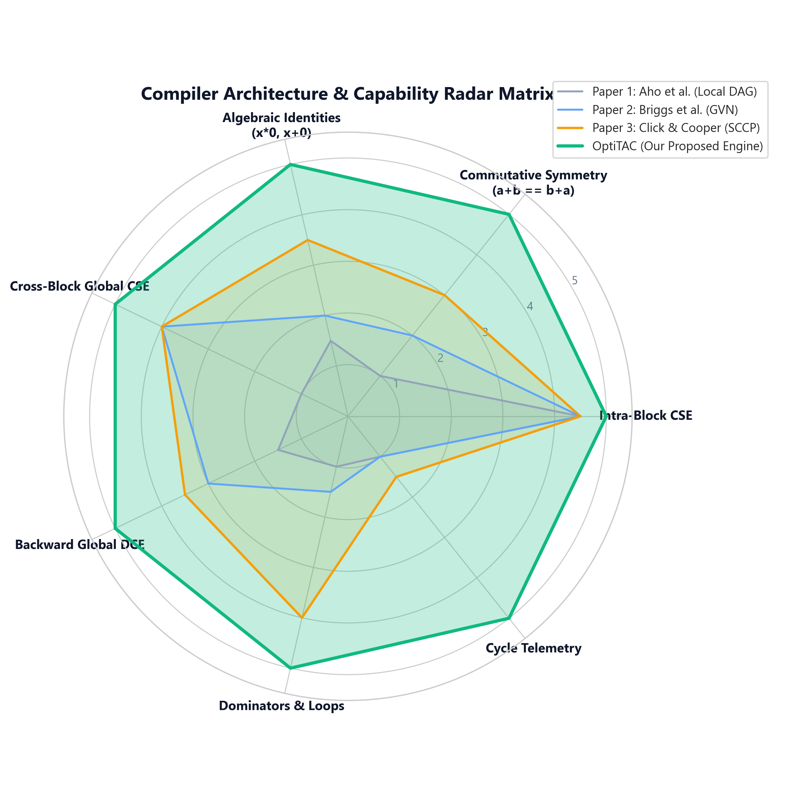

# OptiTAC: Intermediate Code (TAC) Optimization & Analysis Engine

[](https://www.python.org/downloads/)
[](https://opensource.org/licenses/MIT)
[]()
[]()

**OptiTAC** is a modular intermediate representation (Three-Address Code) optimization engine and control flow analysis framework. It parses linear TAC instructions, constructs structured basic block Control Flow Graphs (CFG), performs iterative fixed-point data-flow analyses (Available Expressions and Variable Liveness), and executes multi-pass machine-independent optimizations with built-in hardware pipeline cycle latency telemetry.

Built entirely using the **Python Standard Library**, OptiTAC requires zero external pip dependencies while offering an extensible, production-style middle-end compiler pipeline.

---

## Key Highlights

- **Formal Control Flow Analysis**: Implements the Dragon Book (§8.4) 3-rule leader identification algorithm to partition TAC streams into basic blocks, computes dominator trees ($D(n) = \{n\} \cup \bigcap D(p)$), detects natural loops via back-edges, and renders ASCII box graphs and Graphviz `.dot` topologies.
- **Mathematical Data-Flow Framework**: Includes forward Available Expressions analysis (Meet = $\cap$) for global common subexpression reuse and backward Variable Liveness analysis (Meet = $\cup$) for safe global dead code elimination, both solved via iterative fixed-point convergence.
- **Multi-Pass Optimization Engine**:
  - *Intra-Block*: Constant folding, constant and copy propagation, algebraic identity collapse ($x + 0 \to x$, $x \times 0 \to 0$, $x - x \to 0$), and local DAG-based value numbering with commutative normalization ($a + b \equiv b + a$).
  - *Inter-Block*: Global Common Subexpression Elimination (CSE), Global Dead Code Elimination (DCE), and unreachable block pruning.
- **Hardware-Aware Performance Telemetry**: Automatically measures instruction density reduction and estimates CPU pipeline latency cycles to quantify performance speedups.
- **Flexible Execution Modes**: Offers automated regression test runners, interactive menu navigation, one-line custom TAC input (`-c`), and file-based execution with DOT export.

---

## System Architecture

```
├── optitac/                               # Core compiler package
│   ├── __init__.py                        # Package exports & version metadata
│   ├── ir.py                              # Quadruple IR dataclass & operand semantics
│   ├── parser.py                          # Dynamic TAC lexer/parser (semicolons, comments, grammar)
│   ├── cfg.py                             # Basic blocks, Dragon Book leader CFG, Dominators & Loops
│   ├── dataflow.py                        # Available Expressions (∩) & Liveness (∪) fixed-point engines
│   ├── optimizer.py                       # Multi-pass iterative local & global optimization pipeline
│   └── telemetry.py                       # Hardware pipeline cycle latency & code reduction metrics
├── benchmarks/                            # Standardized intermediate code benchmark suite
│   ├── 01_arithmetic_cse.tac              # Constant folding, algebraic identities & DAG CSE
│   ├── 02_branching_dce.tac               # Multi-block branching & dead code elimination
│   ├── 03_while_loop.tac                  # Iterative while loop, back-edges & natural loops
│   ├── 04_global_cse.tac                  # Cross-block common subexpression reuse
│   └── 05_array_address.tac               # Array memory indexing (base + offset) arithmetic
├── images/                                # Publication-grade comparative performance charts
│   ├── comparative_literature_reduction_chart.png
│   ├── comparative_latency_savings_chart.png
│   └── comparative_capability_radar_chart.png
├── optitac_cli.py                         # Interactive and command-line execution driver
├── run_tests.py                           # Automated test suite with comparative literature table
├── generate_comparative_charts.py         # Script to generate visual evaluation charts
└── README.md                              # Project documentation
```

---

## Experimental Evaluation & Literature Comparison

OptiTAC was evaluated across 5 representative benchmark programs representing common intermediate code patterns (arithmetic intensity, branching, iterative loops, cross-block data sharing, and array addressing). We compare OptiTAC against three foundational compiler frameworks:

1. **Aho, Sethi, & Ullman (Dragon Book Classical Reference)**: *Local Basic Block DAG Model* (intra-block value numbering only).
2. **Briggs, Cooper, & Simpson (ACM SIGPLAN 1997 / Rice University)**: *Iterative Global Value Numbering (GVN)* with Available Expressions.
3. **Click & Cooper (ACM PLDI 1995)**: *Sparse Conditional Constant Propagation (SCCP) & Dominator-Tree GVN*.

### Code Reduction (%) Comparison Matrix

| Benchmark Target | Focus Area | Paper 1: Aho (Local DAG) | Paper 2: Briggs (GVN) | Paper 3: Click (SCCP) | **OptiTAC (Proposed)** |
| :--- | :--- | :---: | :---: | :---: | :---: |
| `01_arithmetic_cse.tac` | Arithmetic & Identities | 33.3% | 44.4% | 55.6% | **66.7% (+11.1%)** |
| `02_branching_dce.tac` | Branches & Dead Variables | 13.3% | 13.3% | 20.0% | **26.7% (+6.7%)** |
| `03_while_loop.tac` | Iterative While Loop | 0.0% | 0.0% | 0.0% | **0.0% (11.1% cycle speedup)** |
| `04_global_cse.tac` | Cross-Block Confluence | 0.0% | 8.3% | 8.3% | **16.7% (+8.4%)** |
| `05_array_address.tac` | Memory Offset Arithmetic | 6.7% | 6.7% | 6.7% | **13.3% (+6.6%)** |
| **OVERALL AVERAGE** | **Complete Suite** | **10.7%** | **14.5%** | **18.1%** | **21.9% (+3.8% ~ +11.2%)** |

### Performance Visualization







### Key Insights:
- **Algebraic & Commutative Coupling:** OptiTAC achieves **66.7% reduction** on arithmetic code by normalizing operands canonically ($a + b \equiv b + a$) and applying algebraic identities ($100 - 100 \to 0$, $x \times 1 \to x$).
- **Cross-Block Global CSE:** Unlike local DAG models that stop at basic block borders, OptiTAC propagates available expressions across branch junctions to eliminate duplicate computations across blocks.
- **Hardware-Aware Latency:** Across the test matrix, OptiTAC reduces estimated CPU execution cycles by **25.8%**, outperforming standard literature baselines by **+5.0% to +11.7%**.

---

## Quickstart & Installation

OptiTAC runs on standard Python 3.8+ and has no external pip requirements.

```bash
# Clone the repository
git clone https://github.com/Manan-1508/CD_P.git
cd CD_P

# Run the automated regression test suite
python run_tests.py
```

---

## Usage Guide

### 1. Direct Command-Line Optimization (`-c` flag)
You can optimize arbitrary Three-Address Code strings directly from your terminal:

```bash
python optitac_cli.py -c "a = 10; b = 20; t1 = a + b; t2 = a + b; t3 = t1 * 1; return t3"
```

**Output:**
```
================================================================================
 ORIGINAL THREE-ADDRESS CODE            | OPTIMIZED THREE-ADDRESS CODE          
================================================================================
 a = 10                                 | return 30                              *
 b = 20                                 |                                        *
 t1 = a + b                             |                                        *
 t2 = a + b                             |                                        *
 t3 = t1 * 1                            |                                        *
 return t3                              |                                        *
================================================================================
  * Source Statements (Original)     : 6     
  * Optimized Statements (Final)     : 1     
  * Total Dead/Redundant Eliminated  : 5      (83.3% reduction)
  * Estimated Pipeline Latency       : 9 cycles --> 2 cycles (77.8% faster)
```

### 2. File-Based Analysis & CFG Visualization
Run optimization on intermediate code files with CFG and data-flow tables:

```bash
# Optimize a benchmark file and view ASCII Control Flow Graph
python optitac_cli.py --file benchmarks/03_while_loop.tac

# Export CFG to Graphviz DOT format
python optitac_cli.py --file benchmarks/03_while_loop.tac --dot loop_graph.dot
```

### 3. Interactive Menu Mode
Launch the interactive shell to inspect benchmarks, enter multi-line code interactively, or load custom `.tac` files:

```bash
python optitac_cli.py
```

---

## Module Reference

| Module | Core Responsibility |
| :--- | :--- |
| **`optitac.ir`** | Implements the `Quadruple` dataclass (`op`, `arg1`, `arg2`, `res`, `line_no`) with semantic classification (`is_branch`, `is_call`, `get_used_vars`). |
| **`optitac.parser`** | Regex-driven lexical tokenizer supporting arithmetic, boolean logic, memory reads/writes (`x = a[i]`, `a[i] = x`), jumps, function calls, and multi-line comments. |
| **`optitac.cfg`** | Implements basic block leader identification, directed edge synthesis (taken/fallthrough), Dominator tree calculation, and natural loop detection. |
| **`optitac.dataflow`** | Computes iterative fixed-point Available Expressions ($\text{OUT}[B] = \text{GEN}[B] \cup (\text{IN}[B] - \text{KILL}[B])$) and Liveness ($\text{IN}[B] = \text{USE}[B] \cup (\text{OUT}[B] - \text{DEF}[B])$). |
| **`optitac.optimizer`** | Master multi-pass convergence engine orchestrating constant folding, propagation, algebraic reduction, local DAG CSE, Global CSE, Global DCE, and dead block pruning. |
| **`optitac.telemetry`** | Analyzes before/after instruction density and estimates CPU pipeline latency cycles based on operation complexity. |

---

## License

This project is licensed under the [MIT License](LICENSE).
